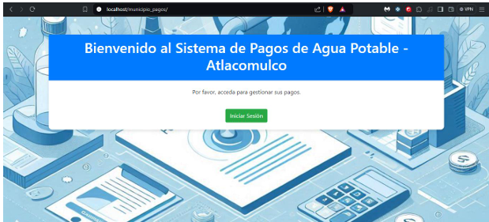
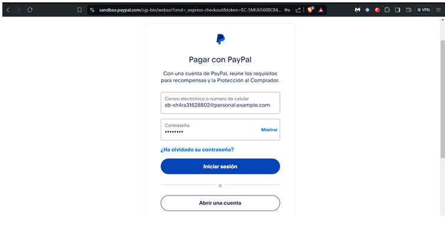
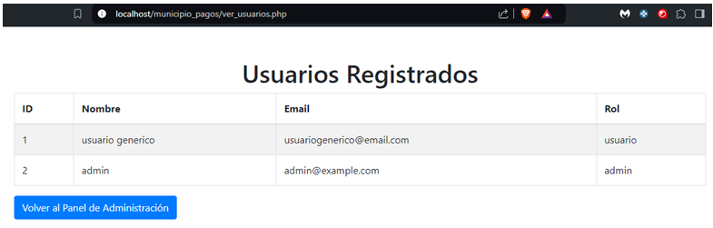

1 # Plataforma de Pagos en Línea para el Servicio de Agua Potable - Municipio de Atlacomulco


2 # Este sistema permite a los ciudadanos de algun municipio realizar poder realizar sus pagos del servicio de agua potable de forma segura y rápida. Desarrollado como proyecto universitario, integra una interfaz intuitiva con autenticación de usuarios y conexión con pasarela de pagos con el SandBox de PayPal.

3 ## Características del proyecto
- Registro e inicio de sesión de usuarios
- Consulta de historial de pagos
- Generación de comprobantes
- Interfaz responsiva con Bootstrap
- Integración con PayPal para pagos en línea
- Backend en PHP y MySQL


4 ## Tecnologías incluidas
- PHP
- MySQL
- Bootstrap
- HTML5 / CSS3
- PayPal API
- Git


5 ## Instalación del repositorio

1. Clonar el repositorio:
   ```bash
   git clone https://github.com/AngelSanchez51/municipio-pagos.git
Copiar el proyecto en la carpeta htdocs de XAMPP:

2. C:\xampp\htdocs\municipio-pagos
Crear una base de datos en phpMyAdmin llamada municipio_pagos.

3. Importar el archivo .sql ubicado en la carpeta /database.

4. Configurar el archivo de conexión a base de datos en /includes/conexion.php con tus credenciales de MySQL.

5. Asegurarse de tener configurado PayPal Sandbox (modo prueba) si se quiere realizar pagos simulados.

6. Iniciar el servidor Apache y MySQL desde el panel de XAMPP.

7. Acceder desde el navegador:
http://localhost/municipio-pagos

---

6 ### Uso del sistema
```
1. Regístrarse con datos del usuario.
2. Iniciar sesión con cuenta personal.
3. Visualiza tu historial y realiza pagos desde el panel de usuario.
4. Confirma tu pago mediante PayPal y recibe tu comprobante.
```



## Licencia


Este proyecto está bajo la Licencia MIT. Consulta el archivo [LICENSE](LICENSE) para más información.


